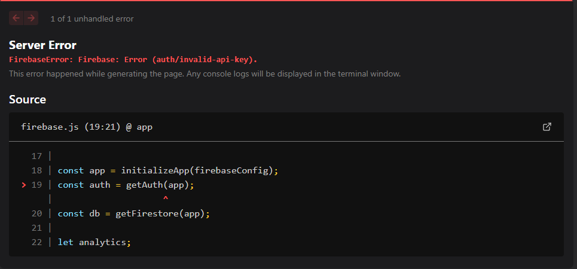

# Firebase API Key Hatası (auth/invalid-api-key)



Bu hatayı alıyorsanız, muhtemelen `.env` dosyanızda Firebase API anahtarlarını yanlış tanımladınız veya eksik girdiniz. Çözüm adımları için aşağıdaki talimatları takip edin:

1. **API Key'in Doğruluğunu Kontrol Edin**:
   - Firebase Console'a gidin.
   - Proje ayarlarından web uygulamanız için doğru API key'i alın.

2. **`.env` Dosyasını Kopyalayın:** 
3. Mevcut .env dosyanızdaki yapılandırmaları alın ve .env.development dosyasına kopyalayın.
4. **Sunucuyu Yeniden Başlatın:**
    ```bash
   npm run dev
   ```

## Notlar:

- `Geliştirme Ortamı:` .env.development dosyası yalnızca geliştirme ortamı için kullanılır. Bu dosyada, Firebase'den aldığınız geliştirme ortamına ait API anahtarlarını ve diğer yapılandırma değerlerini girmeniz gerekir.

- `Üretim Ortamı` (Production): Üretim ortamı için de benzer şekilde .env.production dosyasını kullanabilirsiniz. Firebase'den aldığınız üretim verilerini bu dosyaya girin.

- `Next.js:` Eğer Next.js kullanıyorsanız, ortam değişkenlerinin **`NEXT_PUBLIC_`** ile başlaması gerekir ki bu değişkenler istemci tarafında da kullanılabilsin.


Missing or insufficient permissions. hatası için rule eklenmesi gerekir.